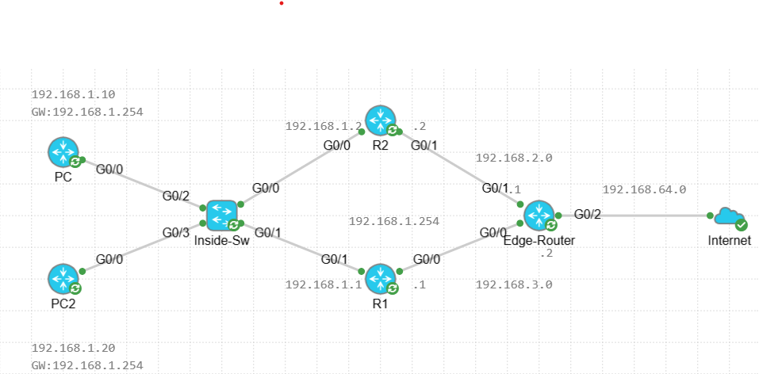

# HSRP with IP SLA – Dual-Uplink Enterprise Failover Lab
## 0. LAB Design 


## 1. Overview
This lab demonstrates a **fully functional HSRP deployment combined with IP SLA tracking on the Edge router** to ensure continuous Internet access during router or uplink failures.

This design addresses a common enterprise issue:

> HSRP alone provides gateway redundancy, but without proper return-path control, traffic can be black-holed when the active router changes.

This solution ensures:
- Correct HSRP failover (LAN default gateway redundancy)
- Correct return routing from the Edge router
- No Internet outage during uplink/router failure

---

## 2. Topology Summary

| Component | Addressing |
|---|---|
| LAN | `192.168.1.0/24` |
| HSRP VIP (Gateway) | `192.168.1.254` |
| R1 (Primary) | LAN `192.168.1.1` / Uplink `192.168.3.1` |
| R2 (Secondary) | LAN `192.168.1.2` / Uplink `192.168.2.2` |
| Edge Router | NAT + Internet |

PCs use **192.168.1.254** as their default gateway.

---

## 3. Design Principles

### Why HSRP Alone Is Not Enough
HSRP controls which router answers ARP for the VIP, but it does **not** guarantee:
- Upstream reachability to the Internet
- Correct return-path selection from the Edge router

Without IP SLA on the Edge:
- R2 can become HSRP Active
- Edge can still forward return traffic toward R1
- Result: **Internet access fails**

---

## 4. Final Working Configurations (with comments)

### 4.1 R1 (Primary HSRP Router)

#### Track the uplink interface state
```cisco
track 1 interface GigabitEthernet0/0 line-protocol
```
Purpose: if R1 uplink goes down, we reduce HSRP priority so R2 can take over.

#### Uplink to Edge
```cisco
interface GigabitEthernet0/0
 ip address 192.168.3.1 255.255.255.0
 standby 10 track 1 decrement 20
```
Note: Tracking is applied to influence HSRP group 10 when uplink fails.

#### LAN interface with HSRP
```cisco
interface GigabitEthernet0/1
 ip address 192.168.1.1 255.255.255.0
 standby 10 ip 192.168.1.254
 standby 10 timers 1 5
 standby 10 priority 110
 standby 10 preempt
 standby 10 authentication abc
 standby 10 name test
 standby 10 track 1 decrement 20
```
Purpose:
- VIP = `192.168.1.254` used by PCs as default gateway
- Higher priority makes R1 preferred Active
- `preempt` allows R1 to regain Active role after recovery
- Authentication helps avoid unwanted HSRP participation

#### Default route toward Edge
```cisco
ip route 0.0.0.0 0.0.0.0 192.168.3.2
```
Purpose: send Internet-bound traffic to Edge via R1 uplink.

---

### 4.2 R2 (Secondary HSRP Router)

#### LAN interface with HSRP
```cisco
interface GigabitEthernet0/0
 ip address 192.168.1.2 255.255.255.0
 standby 10 ip 192.168.1.254
 standby 10 preempt
 standby 10 authentication abc
```
Purpose:
- Shares the same VIP `192.168.1.254`
- Becomes Active when R1 fails (or loses priority due to tracking)

#### Uplink to Edge
```cisco
interface GigabitEthernet0/1
 ip address 192.168.2.2 255.255.255.0
```

#### Default route toward Edge
```cisco
ip route 0.0.0.0 0.0.0.0 192.168.2.1
```
Purpose: send Internet-bound traffic to Edge via R2 uplink.

---

### 4.3 Edge Router (NAT + IP SLA + Tracked Return Routes)

#### Interfaces (inside/inside/outside NAT)
```cisco
interface GigabitEthernet0/0
 ip address 192.168.3.2 255.255.255.0
 ip nat inside

interface GigabitEthernet0/1
 ip address 192.168.2.1 255.255.255.0
 ip nat inside

interface GigabitEthernet0/2
 ip address dhcp
 ip nat outside
```

#### NAT overload for LAN
```cisco
ip nat inside source list 1 interface GigabitEthernet0/2 overload
access-list 1 permit 192.168.1.0 0.0.0.255
```
Purpose: translate LAN traffic (192.168.1.0/24) to the public interface for Internet access.

---

## 5. IP SLA + Tracking (Edge)

### 5.1 IP SLA probes
```cisco
ip sla 1
 icmp-echo 192.168.3.1 source-interface GigabitEthernet0/0
 frequency 5
ip sla schedule 1 life forever start-time now
```
Purpose: monitor reachability of R1 via Edge G0/0.

```cisco
ip sla 2
 icmp-echo 192.168.2.2 source-interface GigabitEthernet0/1
 frequency 5
ip sla schedule 2 life forever start-time now
```
Purpose: monitor reachability of R2 via Edge G0/1.

### 5.2 Track objects
```cisco
track 1 ip sla 1 reachability
track 2 ip sla 2 reachability
```
Purpose: convert IP SLA status into route tracking decisions.

---

## 6. Tracked Static Routes (Critical Fix)

```cisco
ip route 192.168.1.0 255.255.255.0 192.168.3.1 track 1
ip route 192.168.1.0 255.255.255.0 192.168.2.2 5 track 2
```
Purpose:
- Primary return route to LAN via R1 when IP SLA 1 is reachable
- Secondary return route to LAN via R2 (AD 5) when IP SLA 2 is reachable
- Prevents asymmetric routing / blackholing during HSRP failover

---

## 7. Failure Scenarios Tested

### Scenario A – R1 uplink failure
- R1 uplink (G0/0) goes down
- Tracking reduces R1 HSRP priority
- R2 becomes Active for VIP `192.168.1.254`
- Edge switches return route to R2 based on IP SLA
- **PCs keep Internet access**

### Scenario B – R1 recovers
- With preemption enabled, R1 returns to Active (because of higher priority)
- Edge routes revert automatically to R1 (IP SLA 1 reachable)

---

## 8. Notes / Lessons Learned

- **Preemption is required** to force the higher priority router to resume Active role after recovery.
- **Authentication must match** on both routers; mismatch can cause **split-brain (both Active)**.
- Group name does not have to match (it is informational).
- Timer tuning is optional, but keep it consistent and documented.
- HSRP protects the default gateway, but **Edge return routing must also track the active path** (IP SLA solves this).

---

## 9. Verification Commands

### On R1/R2
```cisco
show standby brief
show standby
show track
show ip route 0.0.0.0
```

### On Edge
```cisco
show track
show ip sla statistics
show ip route 192.168.1.0
```

---

## 10. Conclusion
This lab provides a **production-ready pattern** for dual-uplink environments:
- HSRP provides gateway redundancy
- IP SLA + tracked routes ensure correct return traffic
- NAT remains centralized at the Edge router

---

_End of documentation_
